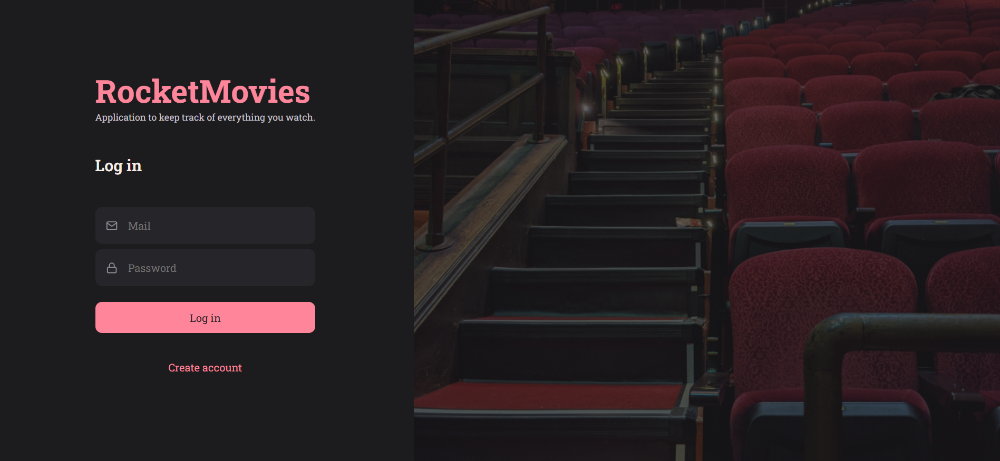

# RocketMovies 🎥

* FrontEnd da aplicação em React e Node.js onde o usuário cadastra um filme, preenche com algumas informações (nome, descrição, nota) e cria tags relacionadas a ele.


  
## Detalhes adicionados ao projeto:
- Criptografia de senhas;
- Validação de e-mail;
- Criação e atualização de usuário;
- Filtro de pesquisa;
- Tratamentos de erros e exceções;
- Adicionar e deletar componentes;
- Aplicação do Cascade para garantir que uma tag será excluída caso o usuário opte por excluir o filme.


## Para rodar a aplicação, use os seguintes comandos:

```
npm install

npm run dev
```
## Acessar projeto - moviesbyrocketseat.netlify.app

### By: [Beatriz Galvão](https://www.linkedin.com/in/beatriz-galmed/) 💜
